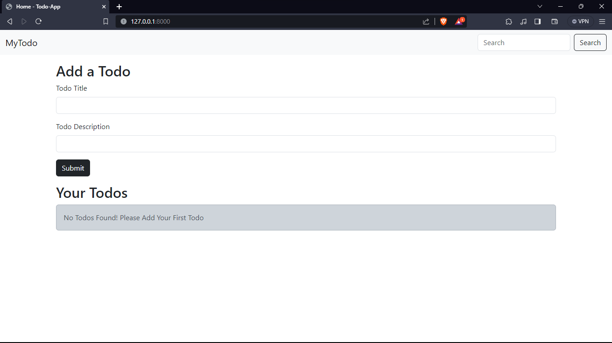
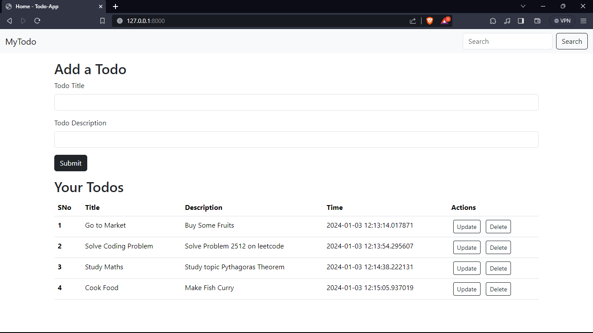
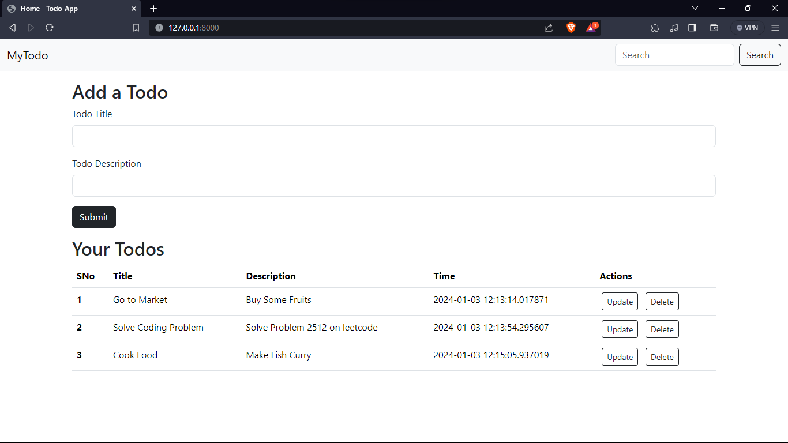
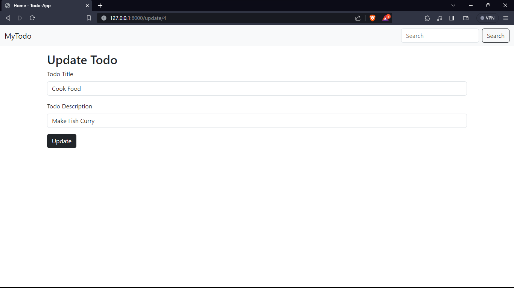

# MyTodo : A Todo Web Application

Welcome to MyTodo : A simple and intuitive task management application built with Flask. This web app is designed to streamline your daily tasks, providing you with the essential tools for creating, organizing, updating, and deleting tasks effortlessly.

**Features**

1. **Create Tasks:** Quickly add new tasks to your to-do list.

2. **Read Tasks:** Easily view your existing tasks in a clean and user-friendly interface.

3. **Update Tasks:** Modify and edit tasks seamlessly as your priorities evolve.

4. **Delete Tasks:** Remove completed or unnecessary tasks with a single click.


## Screenshots
App Preview

Create Todos

Delete Todo "Study Maths"

Update Todo "Cook Food" description from "Make Fish Curry" to "Make Fish Curry and Roti"

App Preview after Update


## Usage

1. Clone the repository

```bash
git clone https://github.com/saurabhsinghaa/Todo-App-Using-Flask.git
```
2. Navigate to project directory
```bash
cd Todo-App-Using-Flask
```

3. Install dependencies

```bash
pip install -r requirements.txt
```
4. Run the Application
```bash
python app.py
```
Visit http://localhost:8000 in your web browser to access the ToDo app.
    
## Authors

- [@saurabhsinghaa](https://www.github.com/saurabhsinghaa)

